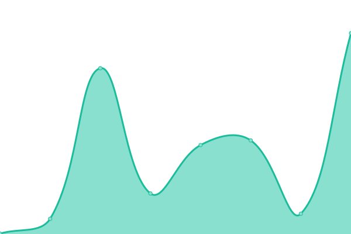
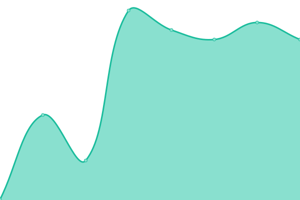
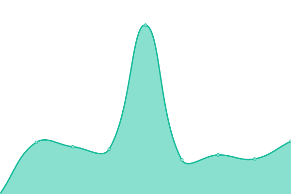
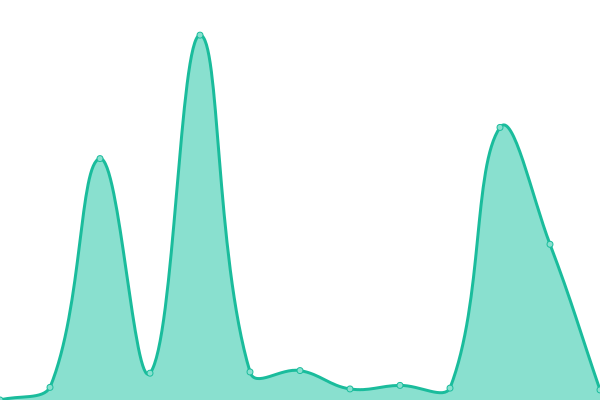

# [📈 Live Status](https://lovelygfj.github.io/uptime): <!--live status--> **🟩 All systems operational**

This repository contains the open-source uptime monitor and status page for [lovelygfj](https://lovelygfj.github.io/uptime), powered by [Upptime](https://github.com/upptime/upptime).

With [Upptime](https://upptime.js.org), you can get your own unlimited and free uptime monitor and status page, powered entirely by a GitHub repository. We use [Issues](https://github.com/lovelygfj/uptime/issues) as incident reports, [Actions](https://github.com/lovelygfj/uptime/actions) as uptime monitors, and [Pages](https://lovelygfj.github.io/uptime) for the status page.

<!--start: status pages-->
<!-- This summary is generated by Upptime (https://github.com/upptime/upptime) -->
<!-- Do not edit this manually, your changes will be overwritten -->
<!-- prettier-ignore -->
| URL | Status | History | Response Time | Uptime |
| --- | ------ | ------- | ------------- | ------ |
|  [Glitch](https://sugar-tattered-anchovy.glitch.me/) | 🟩 Up | [glitch.yml](https://github.com/lovelygfj/uptime/commits/HEAD/history/glitch.yml) | 

 237ms
     
 | 

<a href="https://lovelygfj.github.io/uptime/history/glitch">100.00%</a>
    

|  [Glitch1](https://feather-veil-apparel.glitch.me/) | 🟩 Up | [glitch1.yml](https://github.com/lovelygfj/uptime/commits/HEAD/history/glitch1.yml) | 

 222ms
     
 | 

<a href="https://lovelygfj.github.io/uptime/history/glitch1">100.00%</a>
    

|  [Daki](http://zeus.daki.cc:6006/) | 🟩 Up | [daki.yml](https://github.com/lovelygfj/uptime/commits/HEAD/history/daki.yml) | 

 434ms
     
 | 

<a href="https://lovelygfj.github.io/uptime/history/daki">68.94%</a>
    

|  [Replit_IN_X3](https://x3.lovelygfj2.repl.co/) | 🟩 Up | [replit-in-x3.yml](https://github.com/lovelygfj/uptime/commits/HEAD/history/replit-in-x3.yml) | 

 2819ms
     
 | 

<a href="https://lovelygfj.github.io/uptime/history/replit-in-x3">99.11%</a>
    

<!--end: status pages-->

[**Visit our status website →**](https://lovelygfj.github.io/uptime)

## 📄 License

- Powered by: [Upptime](https://github.com/upptime/upptime)
- Code: [MIT](./LICENSE) © [lovelygfj](https://lovelygfj.github.io/uptime)
- Data in the `./history` directory: [Open Database License](https://opendatacommons.org/licenses/odbl/1-0/)
