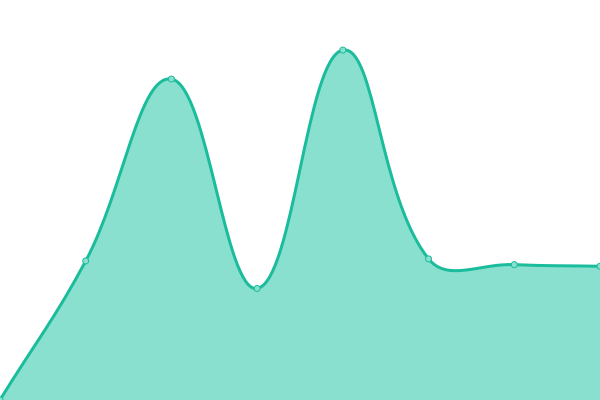

# [📈 Live Status](https://lovelygfj.github.io/uptime): <!--live status--> **🟧 Partial outage**

This repository contains the open-source uptime monitor and status page for [lovelygfj](https://lovelygfj.github.io/uptime), powered by [Upptime](https://github.com/upptime/upptime).

With [Upptime](https://upptime.js.org), you can get your own unlimited and free uptime monitor and status page, powered entirely by a GitHub repository. We use [Issues](https://github.com/lovelygfj/uptime/issues) as incident reports, [Actions](https://github.com/lovelygfj/uptime/actions) as uptime monitors, and [Pages](https://lovelygfj.github.io/uptime) for the status page.

<!--start: status pages-->
<!-- This summary is generated by Upptime (https://github.com/upptime/upptime) -->
<!-- Do not edit this manually, your changes will be overwritten -->
<!-- prettier-ignore -->
| URL | Status | History | Response Time | Uptime |
| --- | ------ | ------- | ------------- | ------ |
|  [Glitch](https://utopian-titanium-rain.glitch.me/) | 🟩 Up | [glitch.yml](https://github.com/lovelygfj/uptime/commits/HEAD/history/glitch.yml) | 

 145ms
     
 | 

<a href="https://lovelygfj.github.io/uptime/history/glitch">100.00%</a>
    

|  [Glitch1](https://brook-amethyst-arrow.glitch.me/) | 🟩 Up | [glitch1.yml](https://github.com/lovelygfj/uptime/commits/HEAD/history/glitch1.yml) | 

 4558ms
     
 | 

<a href="https://lovelygfj.github.io/uptime/history/glitch1">85.04%</a>
    

|  [Replit_IN_X2](https://x2.lovelygfj2.repl.co/) | 🟥 Down | [replit-in-x2.yml](https://github.com/lovelygfj/uptime/commits/HEAD/history/replit-in-x2.yml) | 

 833ms
     
 | 

<a href="https://lovelygfj.github.io/uptime/history/replit-in-x2">66.53%</a>
    

|  [Replit_IN_X3](https://x3.lovelygfj2.repl.co/) | 🟥 Down | [replit-in-x3.yml](https://github.com/lovelygfj/uptime/commits/HEAD/history/replit-in-x3.yml) | 

 772ms
     
 | 

<a href="https://lovelygfj.github.io/uptime/history/replit-in-x3">66.53%</a>
    

<!--end: status pages-->

[**Visit our status website →**](https://lovelygfj.github.io/uptime)

## 📄 License

- Powered by: [Upptime](https://github.com/upptime/upptime)
- Code: [MIT](./LICENSE) © [lovelygfj](https://lovelygfj.github.io/uptime)
- Data in the `./history` directory: [Open Database License](https://opendatacommons.org/licenses/odbl/1-0/)
